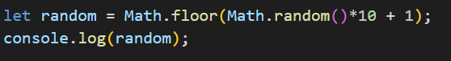
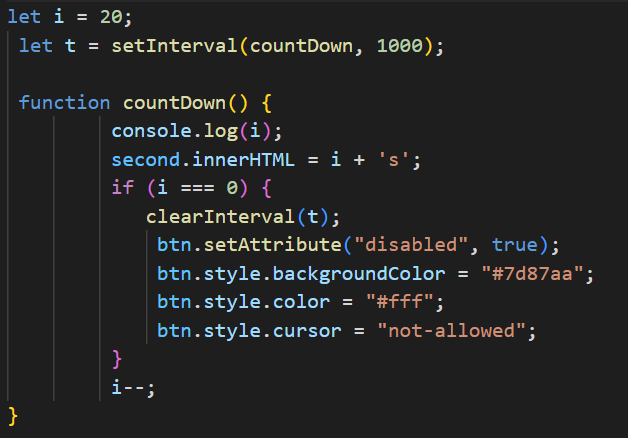
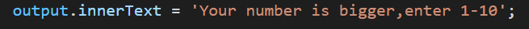

# Guessing-game

A simple point-and-click game made with JavaScript.

## Content
* <a href="https://github.com/Reagan615/guessing-game/edit/main/README.md#game-introduction">Game introduction</a> 
* <a href="https://github.com/Reagan615/guessing-game/edit/main/README.md#introduction-to-operation-instructions">Introduction to Operation Instructions</a> 
* <a href="https://github.com/Reagan615/guessing-game/edit/main/README.md#part-of-the-code-display">Part of the code display</a> 
* <a href="https://github.com/Reagan615/guessing-game/edit/main/README.md#demo">Demo</a> 
* <a href="https://github.com/Reagan615/guessing-game/edit/main/README.md#reference-link">Reference link</a> 
## Game introduction
In the specified time of 20 seconds, use 5 chances of entering numbers to guess the numbers 1-10 (including 1 and 10) randomly generated by the system, the system will prompt the relationship between the entered number and the answer after submitting the answer, Helps players narrow down the guessing scope. Guessing the answer correctly, running out of time, or running out of times will end the game, and you can restart the game with the Play Again button.

## Introduction to Operation Instructions
The following will introduce the three operation instructions that are mainly involved in creating the game using Javascript.
### 1. Use `Math.random()` to create an equation to get random numbers.
`Math.random()`：Math.random() returns a random number between 0 (inclusive), and 1 (exclusive).

For example: 

### 2. Use `setInterval` to create a 20-second countdown.
`setInterval()`：The setInterval() method calls a function at specified intervals (in milliseconds).The setInterval() method continues calling the function until clearInterval() is called, or the window is closed.1 second = 1000 milliseconds.

For example: 

### 3. Use `innerText` to give relevant prompt information
`InnerText`:Get the inner text of an element.

For example: 

## Part of the code display
The code display in the game is mainly used to judge the relationship between the input number and the answer. 
 

## Demo
### **If you are interested in this game:blush:，just click [here](https://reagan615.github.io/guessing-game/) to play.** 

## Reference link
* `Math.random()`:<a href="https://www.w3schools.com/js/js_random.asp"> Math.random()</a> 
* `setInterval()`:<a href="https://www.w3schools.com/jsref/met_win_setinterval.asp"> setInterval()</a> 
* `InnerText`:<a href="https://www.w3schools.com/jsref/prop_node_innertext.asp"> InnerText()</a> 
 
 
 

